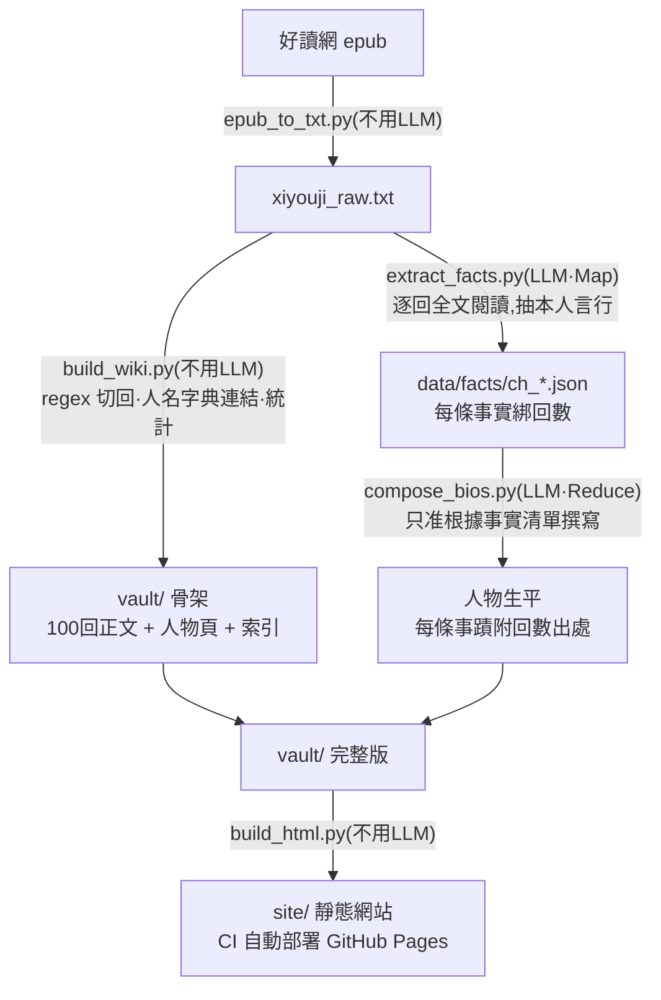

# 西遊記 Wiki

把一本《西遊記》原文(好讀網 epub),自動變成可瀏覽、可查證的 wiki 資料庫。
姊妹作:[三國演義 Wiki](https://github.com/pondahai/sanguo-wiki)(方法論與開發歷程詳見該專案 README)。

全書 100 回正文自動切分、人名自動連結,主要人物各有條目——生平由本地 LLM
以 map-reduce 方式「全文閱讀」原著後生成,**每條事蹟都附回數出處,可回溯查證**。

- **Obsidian vault**(`vault/`):`[[人名]]` 點擊跳轉,graph view 看人物關係網
- **靜態網站**:線上直接看 <https://pondahai.github.io/xiyouji-wiki/>,
  push 後由 CI 自動從 vault 重建部署 GitHub Pages;
  也可本地跑 `python scripts/build_html.py` 後開 `site/index.html` 離線瀏覽

## 緣起

系列第一作是[三國演義 Wiki](https://github.com/pondahai/sanguo-wiki),完整開發歷程
(踩過的坑與學到的事)都記錄在該版 README;之後每一作都仿造前一作
(三國 → 西遊 → 封神 → 水滸),方法論相同,不再重複記錄。

## 與三國版的差異

本 repo 是 sanguo-wiki 的 **config 化重構版**:所有跟「哪本書」有關的設定
(書名、回數、原文路徑、章回標題格式、LLM 端點)集中在 `scripts/config.py`,
人物表在 `scripts/characters.py`。**之後要做紅樓夢等新書,複製本 repo、
改這兩個檔案即可**,其餘腳本不用動。

另外原文來源從 PDF 換成好讀網 epub,新增 `epub_to_txt.py` 取代 pypdf 抽字
(好讀 epub 每章一個 xhtml、段落結構乾淨,比 PDF 可靠)。

## 處理流程



核心原則(教訓詳見三國版 README):
**能用純程式做的絕不用 LLM;必須用 LLM 的,餵齊資料、禁止腦補、要求出處,
然後在它的輸出後面再放一層程式檢查。**

## 快速開始

需要 Python 3(標準庫即可,epub 解析不需外部套件)與一個 OpenAI 相容的
LLM 端點(設定在 `scripts/config.py`)。

```bash
python scripts/epub_to_txt.py 西遊記.epub   # 0. epub → data/xiyouji_raw.txt(秒級)
python scripts/build_wiki.py               # 1. 切章回 + 人名連結 + 人物頁/索引(秒級)
python scripts/extract_facts.py            # 2. Map:逐回全文餵 LLM,抽結構化事實(數小時)
python scripts/compose_bios.py             # 3. Reduce:依事實清單撰寫人物生平
python scripts/build_html.py               # 4. vault → site 靜態網站(秒級)
```

每一步都可中斷重跑:已完成的章回與人物自動跳過。

## 換一本書

1. 複製本 repo
2. 改 `scripts/config.py`:書名、回數、原文檔名、(必要時)章回標題 regex、LLM 端點
3. 換掉 `scripts/characters.py` 的人物表
4. 原文若是好讀 epub 直接跑 `epub_to_txt.py`;其他格式自行轉成
   「回目標題獨立一行、每段一行且以全形空格開頭」的純文字
5. 照跑四步

## 專案結構

```
scripts/config.py     全書設定(換書改這裡)
scripts/characters.py 人物表:正名 + 別名(換書改這裡)
scripts/*.py          流水線:epub_to_txt → build_wiki → extract_facts → compose_bios → build_html
data/xiyouji_raw.txt  原文純文字
data/facts/           逐回事實清單(map 產物,生平的可查證來源)
vault/                Obsidian vault(回目/、人物/、索引)
site/                 靜態 HTML(本地生成,不入 repo;CI 自動建置部署)
```

## 授權

《西遊記》原文為公有領域;文字檔整理感謝[好讀網](https://www.haodoo.net/)。腳本部分隨意使用。
